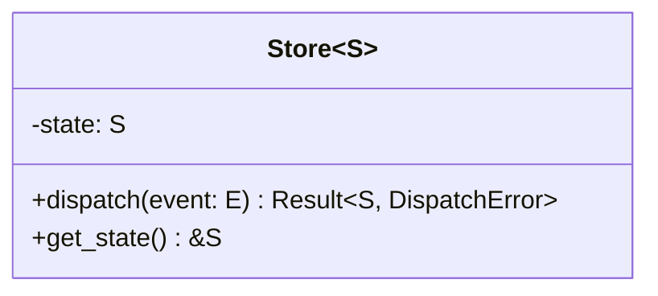

# Document

Take the user's ideas, designs, or code and produce formal documentation. Claude
formalizes — Claude does not create from scratch.

## Arguments

- `$ARGUMENTS`: What to document (e.g., `middleware chain`, `#42`, `src/store.rs`)

## Instructions

### Step 1: Understand the Input

Identify what the user wants documented:

- **An issue** — Read it with `gh issue view`
- **A concept** — Ask clarifying questions if needed
- **Existing code** — Read the relevant symbols with MCP Serena

### Step 2: Produce Documentation

Choose the appropriate output based on context:

#### Mermaid Diagrams

Use the diagram type that best fits:

- **classDiagram** — trait/struct relationships, associated types, generics
- **sequenceDiagram** — event dispatch flow, middleware chain, request lifecycle
- **stateDiagram-v2** — state transitions, store lifecycle
- **graph TB** — architecture overview, module dependencies

#### Rustdoc Comments

Generate `///` doc comments for the user's traits, structs, and functions. Follow
existing patterns in the codebase.

#### README Sections

Write sections for the project README: usage examples, architecture overview, API
summary.

#### Issue Descriptions

Structure issue descriptions following the project template (Context, Proposed Solution,
Acceptance Criteria, Related Issues).

### Step 3: Review Cycle

Present the documentation and **WAIT** for user feedback. Iterate as needed.

### Step 4: Apply

Once approved, apply the documentation:

- **Diagrams/docs** — User decides where to place them
- **Issue updates** — `gh issue edit <number> --body "..."`
- **Rustdoc** — User integrates into their code (or asks Claude to add it)

## Tips

- **Follow existing patterns** — Check how existing modules are documented
- **Keep diagrams focused** — One concept per diagram, not the entire architecture
- **Use concrete types** — Show `Store<AppState>` not just `Store<S>` when illustrating
- **Don't over-document** — If the code is self-explanatory, say so

$ARGUMENTS