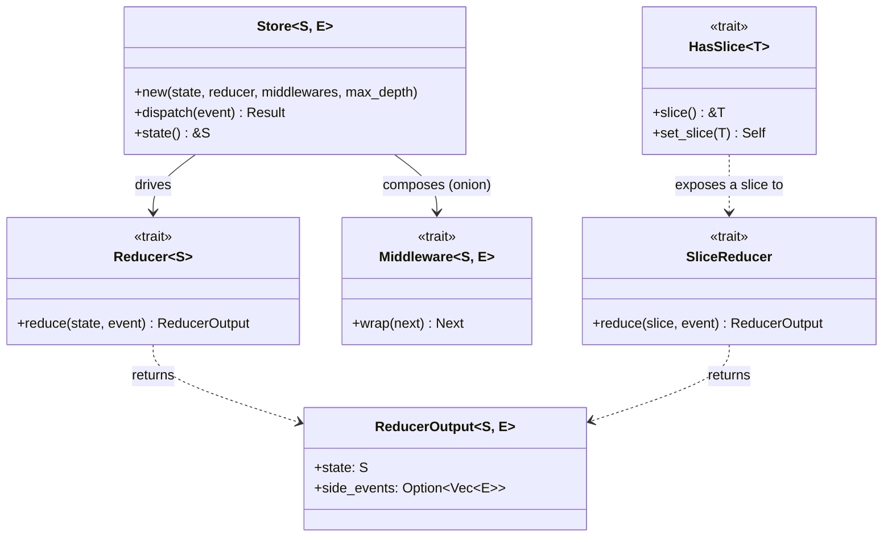

# ruxe

[Redux](https://redux.js.org/)-inspired state management library for Rust with compile-time safe parallel reducers on isolated state slices.

## Why ruxe?

Existing Rust Redux implementations (redux-rs, rust_redux) lack key features: RootReducer, SliceReducer, and parallel execution. ruxe fills that gap by leveraging Rust's ownership model — not as a constraint, but as a feature — to guarantee data-race-free parallel reducers at compile time.

## Quick start

```rust
use ruxe::{Reducer, ReducerOutput, Store};

// 1. Define your state. It must be `Clone`.
#[derive(Clone)]
struct Counter {
    value: i32,
}

// 2. Define events as a typed enum — no stringly-typed actions.
enum Event {
    Increment,
    Decrement,
}

// 3. A reducer is a pure `(state, event) -> new state` transformation.
struct CounterReducer;

impl Reducer<Counter> for CounterReducer {
    type Event = Event;

    fn reduce(&self, state: &Counter, event: &Event) -> ReducerOutput<Counter, Event> {
        let value = match event {
            Event::Increment => state.value + 1,
            Event::Decrement => state.value - 1,
        };
        ReducerOutput {
            state: Counter { value },
            side_events: None,
        }
    }
}

fn main() {
    // No middlewares; cap side-event re-dispatch depth at 8.
    let mut store = Store::new(Counter { value: 0 }, CounterReducer, vec![], 8);

    store.dispatch(Event::Increment).unwrap();
    store.dispatch(Event::Increment).unwrap();
    store.dispatch(Event::Decrement).unwrap();

    assert_eq!(store.state().value, 1);
}
```

For a realistic multi-slice setup with middlewares and side events, see [`examples/ems_sequential.rs`](examples/ems_sequential.rs) — a mini Energy Management System composing three independent state slices (solar, battery, grid meter).

## Design



A tuple `(R1, R2, …)` of `SliceReducer`s is itself a `Reducer<S>` (given `S: HasSlice<Ri::Slice>`), so slice reducers compose into a root reducer with no glue code. `Next<S, E>` is the dispatch-chain closure each middleware wraps, and `DispatchError` is returned when side-event recursion exceeds the configured depth. Parallel composition (`ParallelRootReducer`, rayon-based) is planned.

For exact signatures, trait bounds, and runnable examples, see the rustdoc — run `cargo doc --open` (it will be published on docs.rs once ruxe ships to crates.io).

### Events, not Actions

Redux uses the term "action" for messages dispatched to the store. ruxe uses **event** instead — a better fit for embedded/IoT contexts where state changes are often triggered by external signals (sensor readings, price updates, timer ticks), not user interactions.

## Comparison with redux-rs

[redux-rs](https://github.com/redux-rs/redux-rs) is the most established Redux port for Rust. The two libraries make different tradeoffs:

| Aspect                     | redux-rs                                            | ruxe                                                        |
| -------------------------- | --------------------------------------------------- | ----------------------------------------------------------- |
| Message term               | `Action`                                            | `Event`                                                     |
| State structure            | single state; every reducer sees all of it          | isolated slices — a `SliceReducer` can only reach its slice |
| Root composition           | one reducer combines everything by hand             | a tuple of `SliceReducer`s *is* a `Reducer`, no glue code   |
| Reducer input              | `state: State` (owned, mutate-and-return, no clone) | `state: &S` (borrowed; reducer returns a fresh state)       |
| Side events in reducer     | none — reducers are pure `state → state`            | reducers may emit side events, re-dispatched by the store   |
| Side effects in middleware | yes — re-dispatch via `inner.dispatch().await`      | yes — return side events that the store queues              |
| Execution model            | async-native, requires Tokio                        | synchronous, runtime-agnostic (async planned)               |
| Concurrency                | lock-free multi-producer dispatch via a worker task | single-owner `&mut self`, sequential                        |
| Middleware registration    | manual `.wrap(m).await` chain, separate store type  | passed to `Store::new` (empty `vec` to opt out)             |
| Selectors                  | built-in (`select`, memoized state queries)         | none — slices are accessed directly via `HasSlice`          |
| Parallel reducers          | no                                                  | planned (`ParallelRootReducer`, rayon-based)                |

In short: redux-rs is async-first and ships more batteries (selectors, Tokio integration); ruxe trades those for **compile-time slice isolation**, **side events straight from reducers**, and a **runtime-agnostic synchronous core** that you wrap in whatever execution model you need.

## Roadmap

| Phase   | Feature                            | Status  |
|---------|------------------------------------|---------|
| 1 — MVP | [Store, Event, Reducer][i2]        | done    |
| 1       | [ReducerOutput][i3]                | done    |
| 1       | [SliceReducer][i4]                 | done    |
| 1       | [Sequential RootReducer][i5]       | done    |
| 1       | [Middleware][i6]                   | done    |
| 1       | [Documentation & EMS example][i7]  | planned |
| 2       | [Parallel RootReducer (rayon)][i8] | planned |
| 2       | [Benchmarks][i9]                   | planned |

[i2]: https://github.com/corentin-core/ruxe/issues/2
[i3]: https://github.com/corentin-core/ruxe/issues/3
[i4]: https://github.com/corentin-core/ruxe/issues/4
[i5]: https://github.com/corentin-core/ruxe/issues/5
[i6]: https://github.com/corentin-core/ruxe/issues/6
[i7]: https://github.com/corentin-core/ruxe/issues/7
[i8]: https://github.com/corentin-core/ruxe/issues/8
[i9]: https://github.com/corentin-core/ruxe/issues/9

See [the project epic](https://github.com/corentin-core/ruxe/issues/1) for the full design and task breakdown.

> **Note on parallel reducers**: classic Redux is strictly sequential — each reducer sees the previous one's changes, making state transitions predictable and easy to debug. Parallel reducers trade that guarantee for performance by giving each reducer a frozen snapshot of the state before dispatch. This is arguably an anti-pattern in the Redux sense, but it's an interesting space to explore in performance-sensitive or embedded contexts where state slices are truly independent. ruxe treats it as an opt-in experiment, not a default.

## A learning project

ruxe is built as a Rust learning project. The code is written by hand — Claude Code is configured in **learning mode**: it reviews, challenges, and explains, but does not write implementation code.

The Claude configuration showcasing this workflow is tracked in the repo:

- [`CLAUDE.md`](CLAUDE.md) — project instructions and learning workflow
- [`.claude/rules/learning-mode.md`](.claude/rules/learning-mode.md) — behavioral constraints (what Claude does and doesn't do)
- [`.claude/skills/validate-design/`](.claude/skills/validate-design/) — design validation skill

## License

MIT
