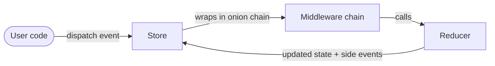
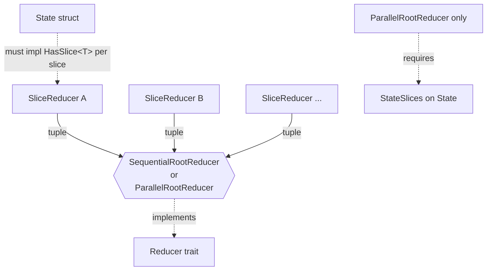

# ruxe

[Redux](https://redux.js.org/)-inspired state management library for Rust with compile-time safe parallel reducers on isolated state slices.

## Why ruxe?

Existing Rust Redux implementations (redux-rs, rust_redux) lack key features: RootReducer, SliceReducer, and parallel execution. ruxe fills that gap by using Rust's ownership model to guarantee data-race-free parallel reducers at compile time.

## Quick start

```rust
use ruxe::{Reducer, ReducerOutput, Store};

// 1. Define your state. (`Clone` is only needed for state subscriptions,
// not for a synchronous store like this.)
#[derive(Clone)]
struct Counter {
    value: i32,
}

// 2. Define events as a typed enum — no stringly-typed actions.
enum Event {
    Increment,
    Decrement,
}

// 3. A reducer is a `(&mut state, event)` update.
struct CounterReducer;

impl Reducer<Counter> for CounterReducer {
    type Event = Event;

    fn reduce(&self, state: &mut Counter, event: &Event) -> ReducerOutput<Event> {
        match event {
            Event::Increment => state.value += 1,
            Event::Decrement => state.value -= 1,
        };

        None
    }
}

fn main() {
    // No middlewares; cap side-event re-dispatch depth at 8.
    let mut store = Store::new(Counter { value: 0 }, CounterReducer, vec![], 8);

    store.dispatch(Event::Increment).unwrap();
    store.dispatch(Event::Increment).unwrap();
    store.dispatch(Event::Decrement).unwrap();

    assert_eq!(store.state().value, 1);
}
```

For a realistic multi-slice setup with middlewares, side events, and a side-by-side sequential-vs-parallel comparison, see [`examples/ems.rs`](examples/ems.rs) — a mini Energy Management System composing three independent state slices (solar, battery, grid meter).

## Root reducers — sequential and parallel

When your state is composed of multiple independent slices, define one [`SliceReducer`] per slice, then combine them with one of two root reducers:

```rust
use ruxe::{SequentialRootReducer, ParallelRootReducer};

// Sequential: each reducer sees the previous one's state changes,
// applied in tuple declaration order.
let root = SequentialRootReducer::new((solar_reducer, battery_reducer, meter_reducer));

// Parallel: every reducer reads from the same pre-event state, runs on a
// Rayon worker. Requires the state to implement `StateSlices` declaring
// its slice list — see below.
let root = ParallelRootReducer::new((solar_reducer, battery_reducer, meter_reducer));
```

### Compile-time guarantees of `ParallelRootReducer`

The parallel variant only compiles if the slice-to-reducer mapping is a bijection. Two cases produce a compile error:

| Mistake | Compile error |
| --- | --- |
| Two reducers target the same slice | "ambiguous impl" — the compiler can't resolve which reducer owns the slice |
| A state slice has no matching reducer | "trait bound not satisfied" — no reducer found for the slice |

No runtime check, no data race possible. The compiler refuses to build a parallel root reducer that would race on a shared slice. See [`examples/ems.rs`](examples/ems.rs) for a runnable side-by-side comparison showing a ~3x speedup with three slice reducers each doing ~50ms of work.

### Declaring the slice list

`ParallelRootReducer` requires the state to declare its slice types via [`StateSlices`]. Rust's type system can't enumerate impls of `HasSlice<T>`, so the user lists them explicitly:

```rust
use ruxe::{HasSlice, StateSlices};

impl StateSlices for AppState {
    type Slices<'s> = ruxe::HList!(&'s mut CounterSlice, &'s mut UserSlice);

    fn to_slices(&mut self) -> Self::Slices<'_> {
        (&mut self.counter, &mut self.user).into_hlist()
    }
}
```

A future `#[derive(StateSlices)]` will generate this from the struct fields.

## Async dispatch

The synchronous core stays synchronous; the async layer is **optional** — a plain `Store` works unchanged, and you only bring in the actor loop if you need it. [`init_actor_loop`] wraps a `Store` into an actor loop that owns the state, and hands back a cloneable, `Send + 'static` dispatch handle:

```rust
use ruxe::{init_actor_loop, Store};

let (handle, actor_loop) = init_actor_loop(store, 32);

// You spawn the producers — ruxe never spawns. A cloned handle can
// dispatch from any task or thread.
let mut producer = handle.clone();
tokio::spawn(async move {
    producer.dispatch(event).await.expect("loop is alive");
});
drop(handle); // run() only returns once every handle is dropped

// Drive the loop by awaiting it; it owns the store, serializes every
// dispatch, and returns the final store on clean shutdown.
let store = actor_loop.run().await.expect("clean shutdown");
```

The loop is the store's **sole owner**: dispatch stays lock-free and serialized however many producers feed it, and the core stays runtime-agnostic.

### Reacting to state changes

`init_actor_loop_with_subscription` adds a read side. Alongside the handle and loop it returns a `Stream<Item = Arc<S>>` of state snapshots: it replays the current state on subscribe, yields the settled state after each dispatch (intermediate values coalesced), and ends when the loop stops.

```rust
use futures::StreamExt;
use ruxe::init_actor_loop_with_subscription;

let (handle, actor_loop, mut states) = init_actor_loop_with_subscription(store, 32);

// React from outside the loop: an outbound sink, a controller, ...
tokio::spawn(async move {
    while let Some(state) = states.next().await {
        println!("state changed: {state:?}");
    }
});
```

It stays opt-in: [`init_actor_loop`] and the synchronous store are unaffected, and a snapshot is cloned only while a subscriber is alive (`S: Clone` is required only on this path).

Planned companions:

- **[tokio adapter][i37]** — a reference executor behind a feature flag
- **[event stream][i36]** — react to the dispatched events themselves (`action$`-style)

Runnable demo: [`examples/async_dispatch.rs`](examples/async_dispatch.rs).

## Design

### Runtime pipeline



### Composing slice reducers into a Reducer



Slice reducers compose into a root reducer via either [`SequentialRootReducer<T>`] (applies them in order, updating each slice in place) or [`ParallelRootReducer<L, E, Indices>`] (applies them on Rayon workers, with compile-time disjointness verification). `Next<S, E>` is the dispatch-chain closure each middleware wraps, and `DispatchError` is returned when side-event recursion exceeds the configured depth.

For exact signatures, trait bounds, and runnable examples, see the rustdoc — run `cargo doc --open` (it will be published on docs.rs once ruxe ships to crates.io).

### Events, not Actions

Redux uses the term "action" for messages dispatched to the store. ruxe uses **event** instead — a better fit for embedded/IoT contexts where state changes are often triggered by external signals (sensor readings, price updates, timer ticks), not user interactions.

## Comparison with redux-rs

[redux-rs](https://github.com/redux-rs/redux-rs) is the most established Redux port for Rust. The two libraries make different tradeoffs:

| Aspect                     | redux-rs                                            | ruxe                                                        |
| -------------------------- | --------------------------------------------------- | ----------------------------------------------------------- |
| Message term               | `Action`                                            | `Event`                                                     |
| State structure            | single state; every reducer sees all of it          | isolated slices — a `SliceReducer` can only reach its slice |
| Root composition           | one reducer combines everything by hand             | wrapped in `SequentialRootReducer` / `ParallelRootReducer`  |
| Reducer input              | `state: State` (owned, mutate-and-return, no clone) | `state: &mut S` (borrowed; reducer modifies in-place)       |
| Side events in reducer     | none — reducers are pure `state → state`            | reducers may emit side events, re-dispatched by the store   |
| Side effects in middleware | yes — re-dispatch via `inner.dispatch().await`      | yes — return side events that the store queues              |
| Execution model            | async-native, requires Tokio                        | sync core; optional async ingestion via an actor loop       |
| Concurrency                | lock-free multi-producer dispatch via a worker task | single-owner `&mut self`, parallel reducers via Rayon       |
| Middleware registration    | manual `.wrap(m).await` chain, separate store type  | passed to `Store::new` (empty `vec` to opt out)             |
| Selectors                  | built-in (`select`, memoized state queries)         | none — slices are accessed directly via `HasSlice`          |
| Parallel reducers          | no                                                  | `ParallelRootReducer` (rayon, compile-time disjoint)        |

In short: redux-rs is async-first and ships more batteries (selectors, Tokio integration); ruxe trades those for **compile-time slice isolation**, **side events straight from reducers**, and a **runtime-agnostic synchronous core** that you wrap in whatever execution model you need.

## Roadmap

| Phase   | Feature                            | Status  |
|---------|------------------------------------|---------|
| 1 — MVP | [Store, Event, Reducer][i2]        | done    |
| 1       | [ReducerOutput][i3]                | done    |
| 1       | [SliceReducer][i4]                 | done    |
| 1       | [Sequential RootReducer][i5]       | done    |
| 1       | [Middleware][i6]                   | done    |
| 1       | [Documentation & EMS example][i7]  | done    |
| 2       | [Parallel RootReducer (rayon)][i8] | done    |
| 2       | [Benchmarks][i9]                   | planned |
| 3       | [Async dispatch (actor loop)][i23] | done    |
| 3       | [tokio adapter][i37]               | planned |
| 3       | [State-change subscription][i35]   | done    |
| 3       | [Event-stream subscription][i36]   | planned |

[i2]: https://github.com/corentin-core/ruxe/issues/2
[i3]: https://github.com/corentin-core/ruxe/issues/3
[i4]: https://github.com/corentin-core/ruxe/issues/4
[i5]: https://github.com/corentin-core/ruxe/issues/5
[i6]: https://github.com/corentin-core/ruxe/issues/6
[i7]: https://github.com/corentin-core/ruxe/issues/7
[i8]: https://github.com/corentin-core/ruxe/issues/8
[i9]: https://github.com/corentin-core/ruxe/issues/9
[i23]: https://github.com/corentin-core/ruxe/issues/23
[i35]: https://github.com/corentin-core/ruxe/issues/35
[i36]: https://github.com/corentin-core/ruxe/issues/36
[i37]: https://github.com/corentin-core/ruxe/issues/37

See [the project epic](https://github.com/corentin-core/ruxe/issues/1) for the full design and task breakdown.

> **Note on parallel reducers** — a deliberate departure from Redux orthodoxy:
>
> - Classic Redux is strictly sequential: each reducer sees the previous one's changes, which keeps state transitions predictable and easy to debug.
> - `ParallelRootReducer` trades that guarantee for performance: every reducer reads a frozen snapshot of the pre-dispatch state.
> - Arguably an anti-pattern in the Redux sense — ruxe ships it as an explicit choice for performance-sensitive or embedded contexts where slices are truly independent, never as the default.

## A learning project

ruxe is built as a Rust learning project. The code is written by hand — Claude Code is configured in **learning mode**: it reviews, challenges, and explains, but does not write implementation code.

The Claude configuration for this workflow is tracked in the repo:

- [`CLAUDE.md`](CLAUDE.md) — project instructions and learning workflow
- [`.claude/rules/learning-mode.md`](.claude/rules/learning-mode.md) — behavioral constraints (what Claude does and doesn't do)
- [`.claude/skills/validate-design/`](.claude/skills/validate-design/) — design validation skill

## License

MIT
