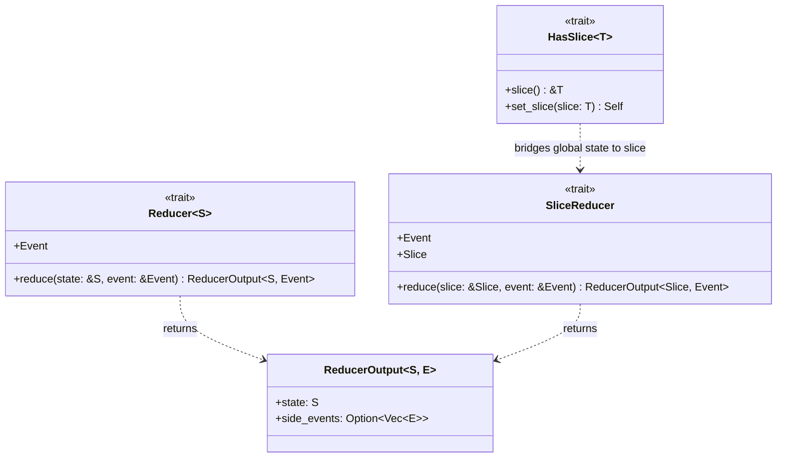

# Architecture

## Reducer traits

Ruxe exposes two reducer traits with different scopes:

- `Reducer<S>` — operates on the full state tree
- `SliceReducer` — operates on an isolated slice of the state

Both produce a `ReducerOutput` containing the new state and optional side events
to re-dispatch.

`HasSlice<T>` bridges the global state to a slice: the user implements it on their
state struct to expose each slice for reading (`slice`) and replacement
(`set_slice`).

## Isolation by construction

Slice reducers cannot access other slices. The `SliceReducer::reduce` method
only receives `&Self::Slice` — no other slice is in scope, so access is
structurally impossible rather than checked at runtime.

This property is what makes slice reducers candidates for parallel execution
(planned).
