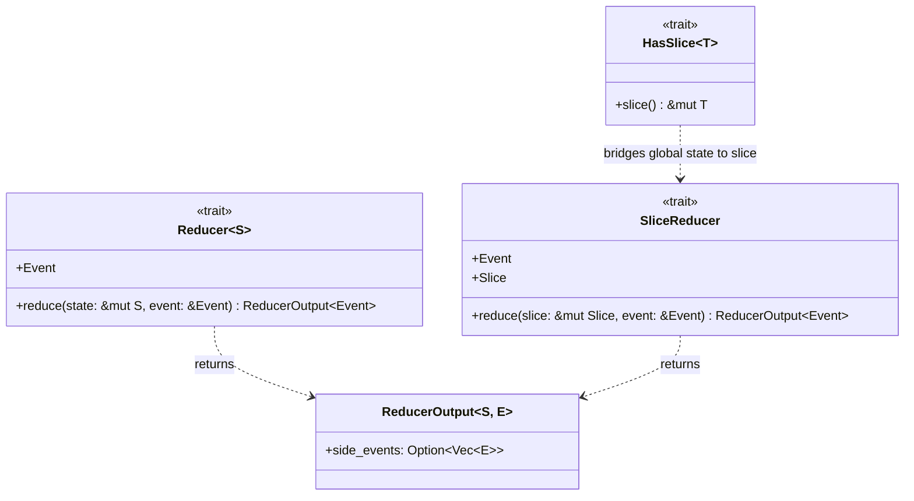

# Architecture

## Reducer traits

Ruxe exposes two reducer traits with different scopes:

- `Reducer<S>` — operates on the full state tree
- `SliceReducer` — operates on an isolated slice of the state

Both update the state and produce a `ReducerOutput` containing optional side events
to re-dispatch.

`HasSlice<T>` bridges the global state to a slice: the user implements it on their
state struct to expose each slice (`slice_mut`).

```mermaid
classDiagram
    class Reducer~S~ {
        <<trait>>
        +Event
        +reduce(state: &mut S, event: &Event) ReducerOutput~Event~
    }

    class SliceReducer {
        <<trait>>
        +Event
        +Slice
        +reduce(slice: &mut Slice, event: &Event) ReducerOutput~Event~
    }

    class HasSlice~T~ {
        <<trait>>
        +slice() &mut T
    }

    class ReducerOutput~S, E~ {
        +side_events: Option~Vec~E~~
    }

    Reducer ..> ReducerOutput : returns
    SliceReducer ..> ReducerOutput : returns
    HasSlice ..> SliceReducer : bridges global state to slice
```

## Isolation by construction

Slice reducers cannot access other slices. The `SliceReducer::reduce` method
only receives `&mut Self::Slice` — no other slice is in scope, so access is
structurally impossible rather than checked at runtime.

This property is what makes slice reducers candidates for parallel execution.
